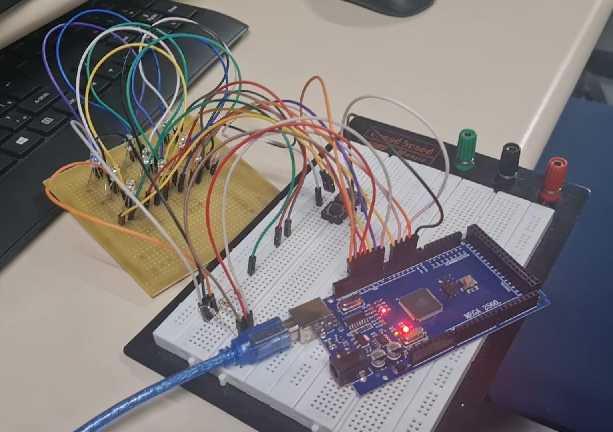
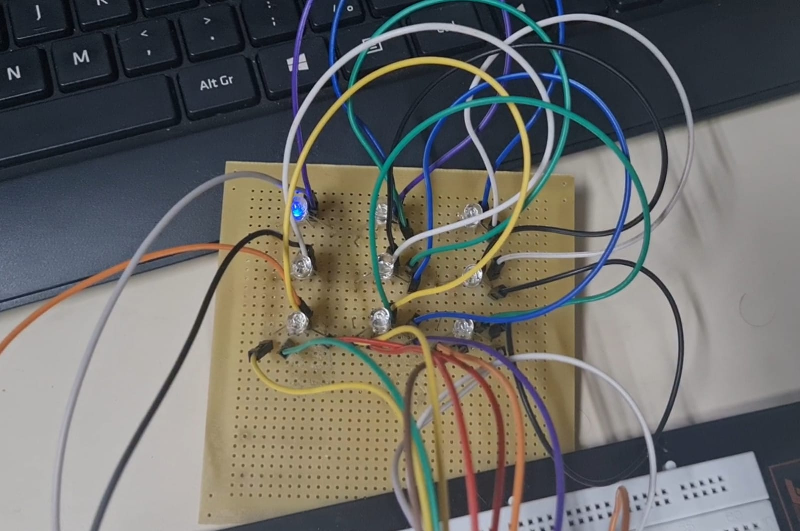
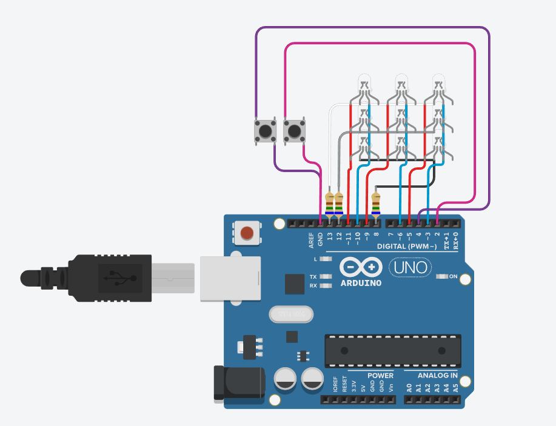

# SCC0180-Arduino-Jogo-Da-Velha
Projeto de jogo da velha no Arduino para a disciplina de Eletrônica para Computação (SCC0180), cursada em 2022 na USP.

  
  

## Visão Geral
O objetivo é fazer um jogo da velha jogador vs jogador.

## Componentes escolhidos
| Quantidade | Componente        			                  | Valor R$ |
|------------|------------------------------------------|----------|
| 1          | ARDUINO UNO R3                       	  | [R$ 128,90](https://www.filipeflop.com/produto/placa-uno-r3-cabo-usb-para-arduino/) |
| 10         | RESISTOR CR25 680R CARVAO ROHS           | R$ 0,07  |
| 4          | JUMPER MACHO X MACHO 20CM TOWER KIT      | R$ 7,00  |
| 2          | CHAVE TÁTIL 12X12X4,3MM 180GR. TOWER  	  | R$ 1,20  |
| 9          | LED 5MM RGB 4 TERMINAIS CATODO(-) COMUM  | R$ 3,50  |
| **Total**  |                    			                | R$ 191,50 |

OBS: Todos os componentes, exceto a placa, foram comprados na loja física CA AND MA - Componentes Eletrônicos no dia 26/07/2022.

## Esquemático no Tinkercad

## Vídeo explicativo

